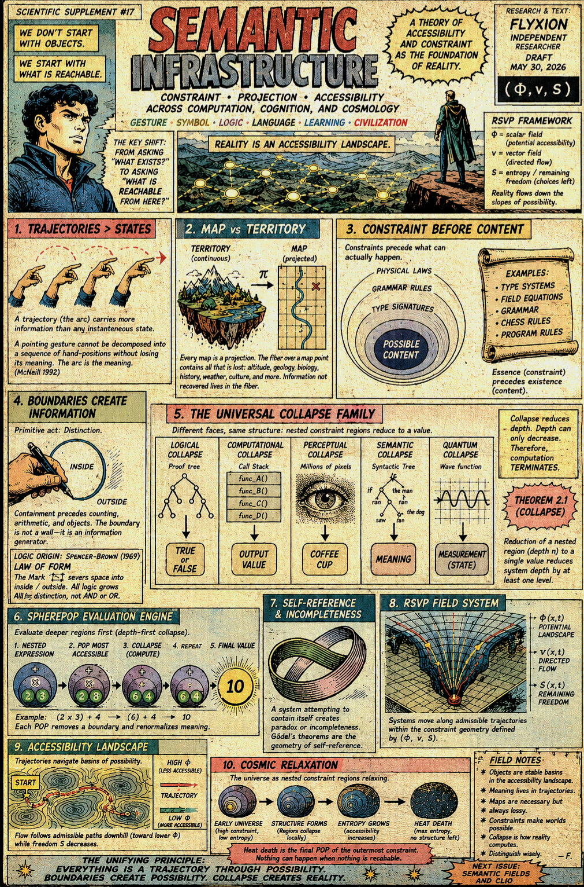
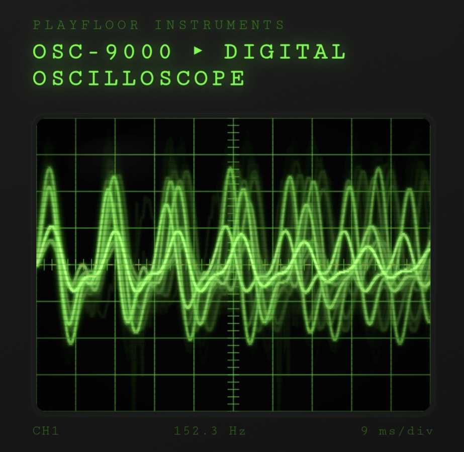

# Playfloor

[Reachability Framework](https://github.com/standardgalactic/playfloor/blob/main/reachability/README.md)

[Semantic Infrastructure](https://standardgalactic.github.io/playfloor/processing/semantic-infrastructure.pdf)

* [Accessibility Geometry](https://standardgalactic.github.io/playfloor/processing/Accessibility_Geometry.pdf)



[The Dynamics of Learning](https://standardgalactic.github.io/playfloor/dynamics-of-learning.pdf)

* [Audio Overviews](https://standardgalactic.github.io/playfloor/audio-overviews.html)

[Admissible Trajectories](https://github.com/standardgalactic/playfloor/blob/main/processing/README.md)

A retro-inspired digital oscilloscope and signal visualizer built entirely in a single HTML file using the Web Audio API and HTML5 Canvas.

Playfloor recreates the feel of vintage phosphor CRT instrumentation while supporting live microphone input, synthesized waveform generation, phosphor persistence effects, trigger synchronization, scanlines, glow rendering, and interactive diagnostic controls. The project combines old laboratory hardware aesthetics with modern browser-native audio processing and visualization.

The entire system runs with no dependencies, no frameworks, and no build step.



## Features

- Real-time microphone waveform visualization
- Sine, sawtooth, noise, and Lissajous modes
- CRT phosphor persistence simulation
- Trigger level synchronization
- Adjustable gain and time-base controls
- Frequency estimation and live readouts
- Scanlines, glow, glare, and vignette overlays
- Responsive fullscreen-style layout
- Single-file architecture
- Graceful fallback if microphone access is unavailable

## Modes

### Microphone

Captures live audio through the browser microphone using the Web Audio API.

### Sine

Displays a synthesized sine wave for stable waveform inspection.

### Sawtooth

Renders a classic sawtooth oscillator useful for timing and slope visualization.

### Noise

Generates pseudo-random white noise for chaotic waveform rendering.

### Lissajous

Switches into XY mode and renders animated Lissajous figures using coupled oscillators.

## Controls

| Control | Description |
|---|---|
| Gain | Adjusts vertical waveform amplification |
| Time Base | Controls horizontal sample scaling |
| Trigger Level | Sets rising-edge synchronization threshold |
| Phosphor Decay | Controls persistence and afterglow fading |

## Visual Design

Playfloor simulates several characteristics of analog CRT displays:

- Phosphor bloom and glow
- Persistence trails
- Scanline overlays
- Barrel-style vignette shading
- Oscilloscope grid divisions
- Trigger reference lines
- Green monochrome phosphor rendering
- Retro industrial chassis styling

The interface intentionally resembles late-1970s and early-1980s laboratory instrumentation.

## Technical Details

The project is implemented using:

- HTML5 Canvas
- Web Audio API
- MediaStream microphone capture
- Real-time waveform rendering
- Frequency estimation via zero-crossing analysis
- Responsive CSS layout
- Custom phosphor persistence simulation

No libraries or frameworks are used.

## Running the Project

Open the HTML file directly in a modern browser.

For microphone access, browsers generally require either:

- `localhost`
- HTTPS

Example:

```bash
python3 -m http.server 8000
```

Then open:

```text
http://localhost:8000
```

## Project Structure

```text
playfloor/
└── index.html
```

Everything — rendering, styling, signal generation, audio processing, controls, and interaction logic — exists inside a single self-contained file.

## Browser Support

Recommended browsers:

- Google Chrome
- Chromium
- Microsoft Edge
- Firefox

## Inspiration

Playfloor draws inspiration from:

- Analog oscilloscopes
- Vector displays
- CRT terminals
- Laboratory instrumentation
- Audio diagnostic hardware
- Retro-futurist interfaces
- Phosphor display systems

## Future Ideas

Potential additions include:

- Stereo dual-channel mode
- FFT spectrum analyzer mode
- Signal generator controls
- Custom phosphor palettes
- Oscilloscope screenshots
- MIDI visualization
- VHS/CRT geometric distortion
- Audio recording/export
- Vector persistence accumulation
- Audio-reactive shader effects

## License

MIT License.
