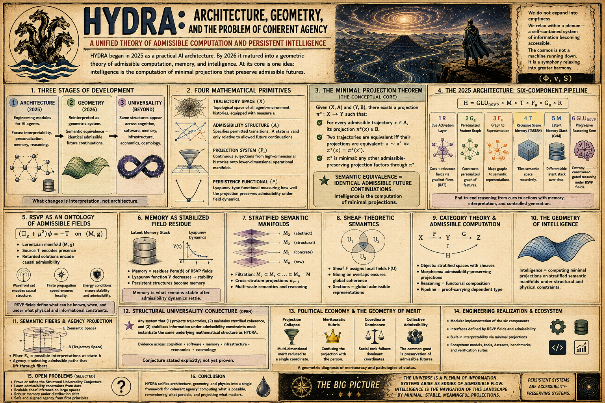

# Theory of Knowledge 

[Epistemic Reduction](https://standardgalactic.github.io/playfloor/epistemology/epistemic-reduction.pdf)

* [The Geometry of Understanding](https://standardgalactic.github.io/playfloor/epistemology/The_Geometry_of_Understanding.pdf)

[The Projection Crisis](https://standardgalactic.github.io/playfloor/epistemology/projection_crisis.pdf)

* [The Projection Crisis](https://standardgalactic.github.io/playfloor/epistemology/The_Projection_Crisis.pdf)

[Hydra Architecture](https://standardgalactic.github.io/playfloor/epistemology/hydra_architecture.pdf)

* [Geometric Agency](https://standardgalactic.github.io/playfloor/epistemology/Geometric_Agency.pdf)

[Epistemology Survey Instrument](https://standardgalactic.github.io/playfloor/epistemology/) — *Audio Overviews*

