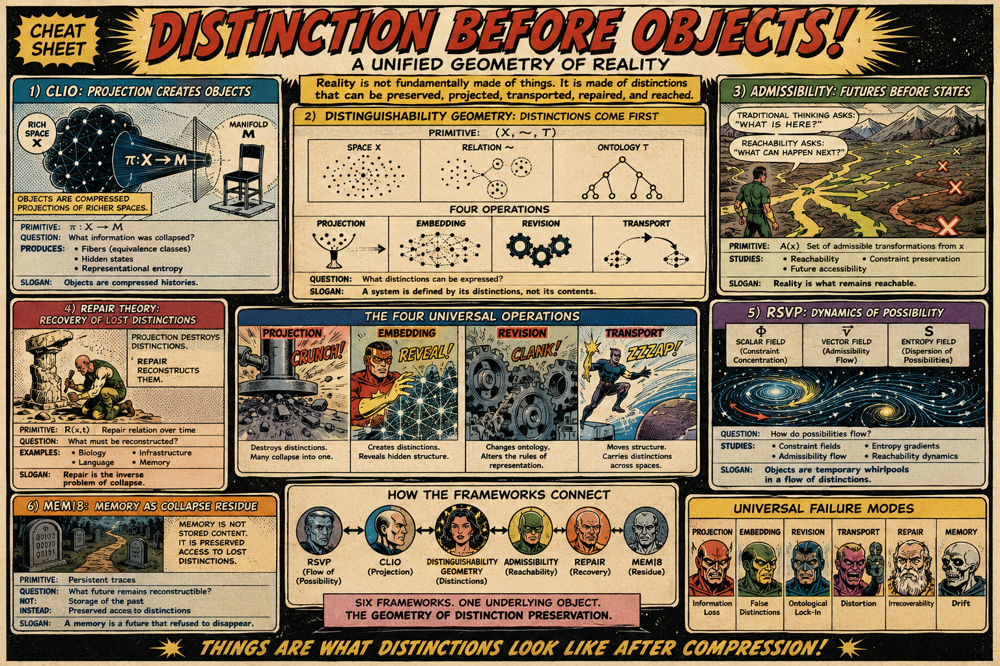

# Distinguishability Geometry

[Activation Manifolds as Admissibility Fields](https://standardgalactic.github.io/playfloor/working/admissibility_fields.pdf)

* [The Topography of Possiblity](https://standardgalactic.github.io/playfloor/working/The_Topography_of_Possibility.pdf)

* [The Cloak](https://standardgalactic.github.io/playfloor/working/the-cloak.pdf) — *Graphic Novel*

* [The Geometry of Escape](https://standardgalactic.github.io/playfloor/working/The_Geometry_of_Escape.pdf) — *Notes*

[Beyond Prediction](https://standardgalactic.github.io/playfloor/working/beyond_prediction.pdf)

* [The Geometry of Reachability](https://standardgalactic.github.io/playfloor/working/The_Geometry_of_Reachability.pdf)

[Programs as Histories](https://standardgalactic.github.io/playfloor/working/programs-as-histories.pdf)

* [The Spherepop Inversion](https://standardgalactic.github.io/playfloor/working/The_Spherepop_Inversion.pdf)

[Distinguishability Geometry](https://standardgalactic.github.io/playfloor/working/distinguishability_geometry.pdf)

* [Notes](https://standardgalactic.github.io/playfloor/working/The_Geometry_of_Distinguishability.pdf)

[Distinction Before Objects](https://standardgalactic.github.io/playfloor/working/distinction_before_objects.pdf)

[Audio Overviews](https://standardgalactic.github.io/playfloor/working/)

